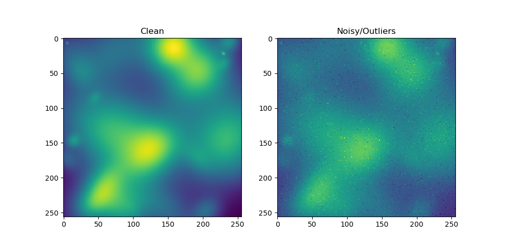
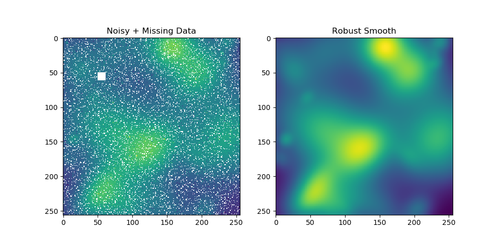

# robust_smooth_2d
A simplified Python translation of Damien Garcia's MATLAB code for interpolating and smoothing data with robust outlier detection. Garcia's code works for 1D, 2D, and 3D data and can also handle multiple components (e.g., vector components at each location in a 2D field). This stripped down Python translation only handles single component 2D data, e.g., grayscale images. 

A few keyword arguments are provided for testing: 
1. You can manually specify a smoothing factor, e.g., _s=15_, which will over-ride the built-in automated computation.
2. You can turn off the robust outlier detection with _robust=False_.

If you want to simply smooth an image, there are plenty of other methods you can use that may work better. Same if you just want to interpolate missing pixels in an image. But if you have data that contains outliers and missing pixels, this appears to be a good solution.

As with any smoothing algorithm, you lose valid high frequency information. However, by using a robust method for downweighting outliers, the algorithm is able to apply less aggressive smoothing, which in turn retains more of the valid high frequency information.

# Notes
* The number of iterations, which is controlled by the hard-coded _tolerance_ threshold value, impacts the smoothing (in addition to the smoothing factor _s_).
* Outlier detection is influenced by the hard-coded divisor of the studentized residuals in the bisquare weight computation.

# References
* Garcia, D., 2010, [Robust smoothing of gridded data in one and higher 
dimensions with missing values in Computational Statistics and Data Analysis](https://www.sciencedirect.com/science/article/pii/S0167947309003491?via%3Dihub), 
Computational Statistics and Data Analysis.
* Garcia, D., 2011, [A fast all-in-one method for automated post-
processing of PIV data](https://link.springer.com/article/10.1007/s00348-010-0985-y), Experiments in Fluids.
* MATLAB File Exchange: https://www.mathworks.com/matlabcentral/fileexchange/25634-smoothn
* Garcia's website: http://www.biomecardio.com/en/index.html
